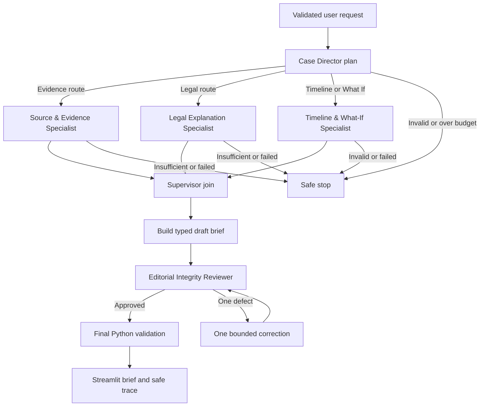

# CASE//LENS Architecture

## Governing boundary

The LLM interprets and explains. LangGraph controls routing, joining, retries,
and budgets. Python validates all inputs/outputs and executes deterministic
tools. Curated local sources ground factual and legal claims.

## Exactly five roles

1. Case Director — the sole Supervisor
2. Source & Evidence Specialist
3. Legal Explanation Specialist
4. Timeline & What-If Specialist
5. Editorial Integrity Reviewer

Specialists do not call one another. The Supervisor owns the plan, delegation,
join, and one response. The Reviewer performs one bounded review and adds no new
facts.

## Planned workflow

The final graph will prevent a second repair loop; the diagram's correction
edge represents at most one correction and recheck.

## Reasoning patterns

- Plan-and-Execute: the Director creates a small mode-dependent plan.
- ReAct: a selected specialist chooses only an allowed retrieval/tool action,
  observes structured output, and returns a bounded finding.
- Bounded Reflection: the Reviewer returns at most one structured defect and a
  second failure stops safely.

## State and ownership

The A1 `CaseLensState` is immutable and typed. It contains session/request and
closed-case status, safe short-term messages, plans/tasks, retrieval
rounds/references, specialist-owned findings, reserved draft/review/final brief
slots, validation errors, retry/call/step/turn counters, audit events, workflow
status, and completion reason. Input, memory, Supervisor, each specialist, and
the future Reviewer can update only their explicit field sets. Messages,
errors, audit events, and retrieval references use append-only reducers.

## Memory

Short-term memory retains safe user questions, safe final answers, language,
selected IDs, and concise finding summaries. Reset starts a new session. Raw
prompts, chain-of-thought, model payloads, and personal long-term memory are
excluded. The curated knowledge base is read-only at runtime.

## Agentic RAG

Track B validates approved documents, chunks by H2 section, generates
`gemini-embedding-2` embeddings at 768 dimensions, and stores transparent NumPy
vectors with metadata. A RAG specialist may plan, retrieve, assess, reformulate
once, then return cited sufficiency or explicit insufficiency. Retrieval must
affect the finding or final brief.

## Deterministic tools

- Timeline routes may call `query_case_timeline`.
- Claim routes may call `check_claim_support`.
- What-If routes may call `simulate_counterfactual` for curated changes.
- Explain-judgment normally uses legal RAG, not decorative tool calls.

## Safe observability

The UI may display agent/phase, route, retrieval count and approved source
titles, tool/status, validation, review, and completion. It may not display
prompts, hidden reasoning, model payloads, credentials, environment values,
unapproved sources, or uncited allegations as fact.

## Stopping and budgets

One Supervisor plan, one normal call per selected specialist, two retrieval
rounds per RAG specialist, one structured-output repair, and one editorial
review plus one correction are the maximums. Completion, clarification,
insufficient evidence, bounded tool/model failure, or step/turn exhaustion ends
the graph. Recursive delegation and peer-to-peer specialist calls are forbidden.

## Integration boundary

Track A injects development fakes through the v1 protocols. Track B implements
the same methods with real RAG/tools. Integration changes the adapter factory,
not the graph or shared schemas.

## A1 routing skeleton status

The deterministic pre-router validates all five modes. The Supervisor creates a
strict mode-specific plan, executes only dependency-ready tasks through
injected v1 fake adapters, and records validation, route, delegation, join,
error, and completion events. Explain Judgment joins independent Evidence and
Legal findings. What-If adds Evidence only when the plan explicitly requires
premise validation. Turn, specialist-call, retry, and graph-step budgets stop
safely. A2 remains responsible for the full LangGraph draft, bounded review,
repair, and final-brief workflow.
